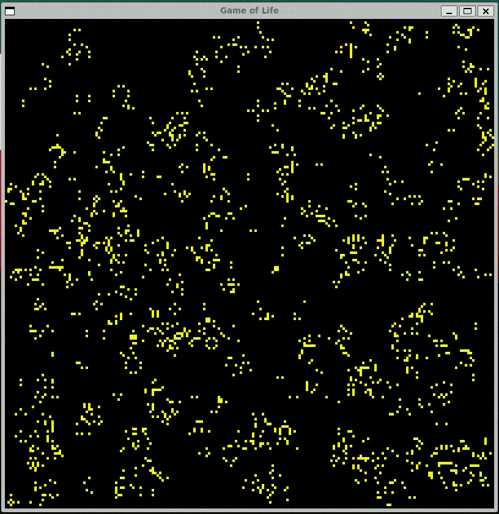

## Game of Life



This repository contains my implementation of [Conway's Game of Life](https://en.wikipedia.org/wiki/Conway%27s_Game_of_Life) written in [Go](https://go.dev/).
It uses [SDL2](https://www.libsdl.org/) to render the simulation inside a window. You can run this app using following command:

```
$ go run main.go
```

There are also three options available when running the app:

- `-X` to set width of window (in pixels, default `800`)
- `-Y` to set height of window (in pixels, default `800`)
- `-Z` to set size of one life (width of square in pixels, default `4`)
